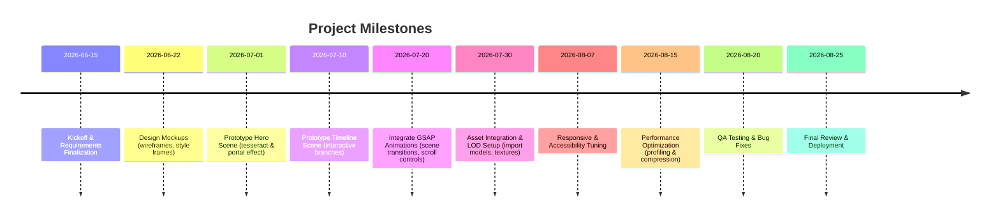

# Executive Summary

This project will transform an existing portfolio site into an **immersive 3D Loki-inspired experience** using Three.js and GSAP. The goal is to impress technical recruiters and design-savvy clients with cinematic visuals (tesseract, TVA portals, timeline tree, “void” scene) **without sacrificing usability**. In essence, the site itself becomes a showcase of 3D web craftsmanship – treating the portfolio as an interactive interface for its users. We will apply UI/UX best practices (logical structure, clear navigation, responsive design) while meeting performance targets (smooth 60 FPS on modern devices, graceful fallbacks on low-end/mobile). This report outlines project goals, audience, feature set, style/animation references, tech stack (Three.js r184, GSAP 3.15, WebGL), asset pipeline (glTF, HDRI, compression), interaction patterns (mouse/keyboard/touch/scroll), UX flows, performance budgets, testing and milestones. The final section provides a copy-ready prompt to guide a creative developer (“Claude-style” instructions).

## Project Goals & Target Audience

- **Goals:** Create a cutting-edge 3D portfolio that showcases the developer’s skills in graphics, animation, and interaction design. Each scene (tesseract hero, TVA-like portals, branching timeline, void) should delight and engage while clearly communicating the portfolio’s content (about, projects, skills, contact). Maintain high usability: recruiters and peers will **spend only a few minutes** on the site, so it must be intuitive and focused.
- **Audience:** Primary users are recruiters, hiring managers, and tech-savvy peers. They appreciate creativity but expect efficient access to information. The experience should also appeal to Marvel/Loki fans and developers who value innovative design.

## Required Features

- **Landing Hero (Tesseract):** A 3D glowing cube (the “tesseract”) at the hero, floating and pulsing with energy (e.g. refractive/emissive material). It beckons the user to interact.
- **TVA Portals:** Ring-shaped portal effects (swirling golden/teal energy fields) that serve as interactive navigation links to different sections. _(For reference: Loki’s TVA portals have golden edges with smoky, swirling interiors.)_
- **Timeline Tree:** A branching “sacred timeline” visualization: an interactive tree diagram of nodes (each node = project/case study) that users can expand or scrub through. Bonsai/tree imagery can inspire the organic branching (see example below). Each branch click or timeline scroll jumps to project details.
- **Void Scene:** A transition zone or final scene (space void with subtle particle effects) that represents the TVA void. Dark, starry background and drifting particles emphasize the other-worldly feel.
- **Interactive Navigation:** Camera and object movements driven by user input: clickable portals, hover highlights, scroll/scrub-driven animations (see GSAP ScrollTrigger). Ensure mouse, touch and keyboard controls (e.g. arrow keys to move along the timeline, touch drag to orbit camera). Visual cues or HUD indicators should guide navigation.
- **Responsive Design:** Layout and 3D elements must adapt to all screen sizes. Mobile users should get simplified interactions (e.g. touch pan/zoom, tap-based nav) and possibly reduced effects.
- **Accessibility:** Provide non-visual fallbacks: alt-text or captions for scenes, keyboard focus and ARIA labels on interactive elements, respect reduced-motion preferences. The core content (text, links) should be available in the HTML layer for screen readers. Avoid flashing effects and ensure contrast for any overlay text.
- **Performance Budget:** Aim for ~60 FPS on mid/high-end devices; if impossible, target 30–45 FPS on lower-end. Keep initial JS/CSS bundle minimal (e.g. <500 KB gzipped if possible) via tree-shaking and code-splitting. Defer heavy assets until needed (lazy-load GLTF models, textures, code). Use compression (Draco, Meshopt, Basis) to shrink assets. Always include a graceful 2D/low-detail fallback (static image or CSS scene) for devices that can’t run WebGL.

## Visual & Animation Style References

- _Portal Effect:_ Inspired by Loki’s TVA, portals have concentric swirling rings of light and a smoky core. We’ll recreate this with particle systems and animated shaders (e.g. fading radial gradients, emissive noise). The glow color palette is gold/teal against a dark environment. Subtle lens-flare or bloom can enhance realism. (Example portal image above.)
- _Tesseract (Landing Hero):_ A glowing crystalline cube. Use a metallic-roughness PBR material with high index-of-refraction or subsurface scattering for a gem-like effect. Include an animated emissive map or shader to make it pulse with power. Environment mapping (HDRi reflections) will ground it in the scene. According to three.js docs, **physically based materials** like `MeshStandardMaterial` or `MeshPhysicalMaterial` yield more accurate realistic results, though at higher GPU cost. We’ll leverage environment maps and an HDR skybox for realistic lighting and reflections (as recommended by three.js for best PBR results).
- **Timeline Tree:** An organic, glowing neural-network or bonsai-tree motif. Nodes and branches can gently animate (pulsing or swaying). Thin neon or bioluminescent lines with subtle glow could represent timeline branches. Particles (fireflies) drifting along branches can indicate progression. The overall look remains realistic (e.g. fine detail on bark-texture branches) but with a slightly stylized color for sci-fi feel.
- **Void Scene:** A vast, dark space with a field of tiny stars/particles. Possibly include faint nebula/gradient. Camera slow drift or gentle particle flow to give a sense of depth. Lighting is very dim, with point lights accenting floating debris or ruins of devices (conveying abandonment). This scene contrasts with the warmer portal zones.
- **Lighting & Materials:** Adopt high-quality PBR workflows. Use HDR environment maps for image-based lighting (skybox or studio HDRI). Mix spotlights or point lights with soft shadows to highlight objects (THREE.js supports high-quality shadows). Avoid flat shading; employ roughness/metalness textures for realism. Consult the Disney BRDF paper (cited by three.js) for guidance. Soft volumetric light or god rays can emphasize portals. Camera moves should feel dynamic (slow dolly/boom-ins, parallax shifts). Use easing in GSAP tweens to mimic cinematic timing.
- **Particle Effects & Post:** Subtle dust motes or sparks in portal edges. Possibly fog or volumetric scattering near the void. Use bloom, film grain or vignette for cinematic mood (sparingly, as they are performance-intensive). Screen-space post FX like ambient occlusion and an optional depth-of-field can boost realism but should be togglable off for performance.

## Technical Stack & Versions

- **Three.js (r184)** – Latest stable (as of 2026) for WebGL/WebGPU support. It provides GLTF loading, PBR materials, and XR support.
- **GSAP (v3.15)** – For robust animations and scroll-triggered sequences. We will use `gsap.timeline()` for choreography and `ScrollTrigger` for scroll-based scrubbing.
- **WebGL / WebXR:** Core rendering via WebGL2 through three.js (automatic fallback to WebGL1 if needed). Optionally enable WebXR for an immersive VR/AR mode if hardware available (three.js provides WebXR helpers). No specific VR framework required unless explicitly adding an AR/VR mode.
- **Bundlers/Frameworks:** Unconstrained; likely use a modern bundler (Vite, Webpack 5, or esbuild) with ES modules. The site could be built as plain JS or within React/Vue/Angular. If unspecified, we’ll keep it framework-agnostic (vanilla JS + modules) to reduce overhead. Use TypeScript for maintainability if desired. The design system should follow 21st.dev conventions (modern, modular CSS or CSS-in-JS) where applicable, though not strictly mandated.
- **Supporting Libraries:** Three.js examples/addons like `GLTFLoader`, `OrbitControls` (or `FlyControls`), `DRACOLoader`, `KTX2Loader`, etc. GSAP plugins like `ScrollTrigger`, `CSSPlugin` (if any HTML elements animate), and `Observer` (for input). No backend required unless for analytics or form submission – focus is on a static/JS front-end.

## Asset Pipeline

- **Model Formats:** Use **glTF/GLB (v2.0)** as the standard 3D asset format. It’s an open Khronos format optimized for web (often called the “JPEG of 3D”). Export static props and animated characters in glb. glTF supports PBR materials and animations. Convert any FBX/OBJ source to glTF via tools like Blender or the Khronos converter.
- **Textures:** All textures (albedo, normal, metalness, roughness, emissive, etc.) should ideally be in **KTX2/Basis** format (Khronos BasisU) for GPU-compressed storage. GLTFLoader supports the `KHR_texture_basisu` extension. This vastly reduces download size. Also prepare standard PNG/JPEG for fallback. Use HDR (Radiance .hdr or .exr) for skyboxes and environment maps (provide mipmaps).
- **HDRI/Environment:** Acquire high-dynamic-range images for key lights (e.g. studio or city night sky HDRI). Pre-generate a PMREM in three.js for image-based lighting.
- **Level of Detail (LOD):** For complex models (e.g. large structures or landscape), create multiple LOD meshes. Use three.js `LOD` objects to switch based on camera distance. Simplify foliage or background models to low-poly for distant view.
- **Compression:** Implement Draco (`KHR_draco_mesh_compression`) and Meshopt (`EXT_meshopt_compression`) where possible. Three.js’ GLTFLoader can decode Draco-compressed meshes with `DRACOLoader`. This can reduce geometry size by 70–90%. For textures, use BasisU (KTX2) to get GPU textures in WebGL.
- **Lazy Loading:** Defer loading large assets until needed. For example, only load non-hero scenes (timeline branches, void props) when the user approaches them. Use dynamic `import()` or GLTFLoader’s `loadAsync()` on demand. Cache assets with a loading manager to avoid redundant downloads.
- **Asset Pipeline Tools:** Use an automated build process: convert models/textures to optimized formats, generate mipmaps, compress assets. Ensure three.js and GSAP are included as modules (node/npm or CDN). For images and static files, use webpack file-loader or similar. Test loading times with devtools and optimize aggressively.

## Interaction Design

- **Mouse/Touch/Keyboard:** Desktop users can drag to orbit or pan the 3D camera (via OrbitControls) and click portals/nodes. Mobile users use touch gestures: drag to orbit, pinch to zoom, tap to select. Implement `DRACOLoader` + `OrbitControls` for smooth navigation. Keyboard arrows or WASD can also navigate along the timeline or rotate. Ensure all clickable items have clear hover/tap states (e.g. glow or highlight).
- **Scroll-Driven Scenes:** Use GSAP’s ScrollTrigger to link page scroll to camera movements or timeline scrubbing. For example, scrolling down could move the camera along the timeline tree, pinning at each node. This provides a narrative flow (like scroll-based storytelling). Treat scroll as a “scrubber” control for certain animations with `scrub: true`.
- **UI Overlays:** Minimal HTML overlay (menu button, info panels). Use CSS 3D or HTML for text labels if needed. GSAP can also animate DOM elements in sync with Three.js via `ScrollSmoother` or synchronized timelines.
- **Hover/Click States:** On hover, portal rings or timeline nodes glow brighter (handled by small GSAP tweens on emissive intensity). Click triggers scene transitions (e.g. GSAP timeline between camera positions). Provide a cursor change or UI prompt when interactive.
- **Custom Controls:** For a highly interactive feel, consider gamepad or gyroscope input (especially if adding a WebXR mode). For simplicity, basic input above suffices. Always provide an on-screen legend or tutorial overlay for controls if the interactions are complex.

## UX Flows & Information Architecture

- **Navigation Map:**
    - **Load → Hero:** User lands on loading screen (animated tesseract). Once ready, camera zooms out to hero scene.
    - **Hero → Timeline:** User action (scroll or click tesseract) warps through a TVA portal to the timeline tree. A portal click can jump to different branches directly.
    - **Timeline → Project Details:** Clicking a node or scrolling to it expands a detail panel (HTML overlay or 3D pop-up) showing project description, images, links.
    - **Return/Jump:** A UI menu (perhaps a stylized TVA badge) allows jumping to any section (home, about, contact). Back button or menu resets camera.
    - **Void as Transitions:** If a wrong branch is clicked or after finishing timeline, the scene may dissolve into a void sequence as a playful “looking glass” effect before returning home.
- **Information Architecture:** The 3D experience **is** the navigation. Content (text, images, links) lives on panels triggered by 3D interactions. Maintain a simple hierarchy: Home (hero) → Sections (via portals) → Content. All essential info (bio, portfolio pieces, contact) must be reachable in ≤3 clicks or scrolls. Clarity of intent is critical – label everything clearly (e.g. “About”, “Work” icons). Follow portfolio best practices: keep key info on first view, use consistent UI elements.

## Performance Targets & Optimization

- **Frame Rate:** Aim for 60 FPS on desktops with discrete GPUs, and ≥30 FPS on mid-range or mobile GPUs. Use `requestAnimationFrame` sync in Three.js. Monitor performance with Chromium DevTools.
- **Bundle Size:** Keep initial JS bundle small (<300–500 KB gzipped). Use lazy imports for heavy libraries (e.g. only load GSAP or loader code when needed). Employ tree-shaking (import only needed three.js modules). Defer non-critical code.
- **Asset Loading:** Prioritize above-the-fold (hero) assets first (tesseract model, immediate environment, one portal). Defer others. Show a loading indicator for big models. Use compressed formats (BasisU textures, Draco meshes) to reduce network cost.
- **Fallbacks:** For low-end devices or browsers without WebGL, detect feature support and fall back to a static 2D version of the site (e.g. poster image of the scene with basic HTML navigation). Provide an HTML “Lite version” link if needed.
- **Level-of-Detail (LOD):** Dynamically reduce mesh detail based on camera distance. Use three.js LOD objects or simply swap to a simpler model at runtime. Simplify materials (disable expensive features like clear-coat or dispersion) on low-power devices.
- **Optimizations:** Bake static shadows/textures where possible (shadow maps, lightmaps). Avoid real-time shadows for every light – use one key shadow light. Limit lights: prefer environment lighting and one directional “sun” light.
- **Citing Best Practices:** As one guide notes, “Lazy-load 3D assets only when needed; compress textures and models; limit polygon count; avoid auto-playing heavy animations on mobile; use fallback visuals for low-end devices”. We will follow these rigorously. Respect user reduced-motion settings by disabling camera shakes or large movements if set.

## Testing & Deployment Checklist

- **Cross-Device/Browser:** Test on Chrome/Firefox/Safari/Edge on desktop and mobile. Ensure WebGL2 fallback. Verify touch vs mouse interactions.
- **Performance Audit:** Run Lighthouse and WebGL performance tools. Check FPS on realistic scenes. Address any 3D bottlenecks.
- **Accessibility:** Verify keyboard navigation through all interactive elements. Check ARIA labels/readability of any HTML overlays. Ensure color contrast on any HUD/text. Test with screen readers – ensure fallback text exists for visual content.
- **Responsiveness:** Test on various screen sizes. Scenes should scale and UI should reflow. Ensure controls (orbit, pinch) work on mobile.
- **Content Verification:** Confirm all portfolio content (text, links, images) is present and correct in the interface. Ensure copywriting is proofed.
- **UX Validation:** Conduct a brief user test with peers. Can a new user understand how to navigate from landing page to a project? Simplify any confusing steps.
- **Deployment:** Bundle and minify assets, set up caching headers. Host on a performant static server/CDN. If single-page-app, ensure fallback `index.html` for 404. Include source maps and error reporting (log exceptions).
- **Documentation:** Prepare a README or doc outlining how to build/run the project, where to update assets, and how to add new content/branches.

## Estimated Effort & Milestones

Assuming a small team (1–2 developers), we estimate ~**8–10 weeks** total. Key milestones (tentative):

Each phase involves reviews/demos to ensure goals are met.

## Deliverables & Acceptance Criteria

- **Working 3D Portfolio Site:** Fully interactive Loki-themed website with all required scenes/features implemented.
- **Responsiveness & Accessibility:** It adapts across devices and passes basic accessibility checks (e.g. WCAG contrast, keyboard navigation).
- **Performance Goals Met:** Demonstrable 60 FPS (or graceful fallback) and optimized load times.
- **Source Code & Assets:** All code (Three.js, GSAP, scripts, styles) and assets (models, textures) delivered in a repository or archive. Clear instructions to build and deploy.
- **Documentation:** README describing tech stack, how to update content, and usage of any custom controls.
- **Acceptance Testing:** Stakeholders (developer/designer) should confirm that animations run smoothly, interactions are intuitive, and the final visual style matches the Loki inspiration.

## Comparison Tables

| **Animation Techniques**              | **Description & Pros**                                                                                                                                                  | **Cons**                                                                                                                                                                     |
| ------------------------------------- | ----------------------------------------------------------------------------------------------------------------------------------------------------------------------- | ---------------------------------------------------------------------------------------------------------------------------------------------------------------------------- |
| **GSAP Tween/Timeline**               | Highly precise control over timing and easing; excellent for choreographed sequences and scroll linking. Can pause/reverse. Integrates with CSS/DOM and Three.js.       | Adds another library (~100 KB). Requires writing JavaScript code for animations. Not GPU-accelerated (tweens update properties on CPU).                                      |
| **Three.js AnimationMixer/Keyframes** | Built-in support for animating skinned meshes or morph targets (GLTF animations). GPU-driven if using skeleton/skinned meshes. Great for character or model animations. | Less flexible timing control compared to GSAP. Harder to sequence unrelated tweens (though can manually control `.time`). No built-in scroll-driver (need linking manually). |
| **CSS3D / Web Animations API**        | Useful for lightweight UI element animations (HUD fade, HTML overlays). Leverages browser engine, performant for simple transforms.                                     | Cannot animate WebGL 3D scene elements. Only suitable for DOM or CSS3D layers. Limited to CSS transform properties. Not ideal for complex 3D object motion.                  |
| **Shader Animation (GLSL)**           | Ultra-fast, done on GPU. Ideal for complex visual effects (distortion, particles, procedural motion). Perfect for portal swirl or transitions.                          | Requires writing GLSL and understanding fragment/vertex shaders. Difficult to coordinate high-level timing without a JS controller.                                          |

| **3D Asset Formats** | **PBR Support**                                                                          | **Compression/Size**                                          | **Animation Support**                                        | **Browser/Tool Support**                                                                          |
| -------------------- | ---------------------------------------------------------------------------------------- | ------------------------------------------------------------- | ------------------------------------------------------------ | ------------------------------------------------------------------------------------------------- |
| **glTF / GLB (v2)**  | Full PBR (metallic-roughness workflow)                                                   | Very efficient, supports Draco/Meshopt/Basis (extensions)     | Yes – supports skinning, morph targets, animations           | Native support in three.js, Babylon, Unity. Many exporters (Blender, Maya, 3ds Max). Widely used. |
| **FBX**              | Can contain PBR-like material definitions but not standardized. Often converted to glTF. | Larger (binary or ASCII). No web-decoding plugins by default. | Yes, can contain animations (skeletons)                      | Supported by 3D tools; needs converter to glTF for web use.                                       |
| **OBJ (+MTL)**       | No PBR (only simple Phong materials via MTL). Textures limited to diffuse, normal.       | Generally large (ASCII). No native compression.               | No (only static mesh, separate formats needed for animation) | Universal support for geometry but outdated.                                                      |
| **USDZ (Apple AR)**  | PBR-capable (uses USD Physically Based Shading)                                          | Compressed bundle for Apple devices                           | Yes (can include USD animations, but limited in web context) | Used mainly in Apple AR quick look. Not natively supported by three.js without converter.         |

| **Performance Trade-Offs**                 | **Effect**                                                                          | **When to Use / Avoid**                                                                                                                             |
| ------------------------------------------ | ----------------------------------------------------------------------------------- | --------------------------------------------------------------------------------------------------------------------------------------------------- |
| High-poly Meshes & High-Res Textures       | + Visual detail – Slows rendering, increases memory/bandwidth                    | Use for hero objects; reduce poly count for off-screen or distant models. Employ LOD.                                                               |
| Full PBR with Multiple Lights              | + Realistic shading and shadows – Expensive fragment shading and many draw calls | Use environment maps (IBL) and 1–2 carefully placed lights instead of many. Bake static lights/shadows if possible.                                 |
| Complex Post-Processing (DOF, Bloom, SSAO) | + Cinematic polish – High GPU cost (fill-rate, renderpasses)                     | Enable only on high-end targets. Provide toggle. Use minimal values (soft DOF, moderate bloom).                                                     |
| Real-time Physics/Particles                | + Dynamic, interactive feel – CPU/GPU overhead                                   | Limit particle count and simulation steps. Use GPU-based particle systems or sprite impostors. Pre-bake physics or reduce frequency on mobile.      |
| Smooth Camera Animations vs Jump Cuts      | + Engaging, natural flow – Can disorient or slow down navigation                 | Use sparingly; e.g. subtle camera easing. Provide skip or fast-travel options if long travels. Respect “reduced motion” setting to cut transitions. |

## Visual Mockup Suggestions

- **Landing Screen:** A dramatic shot of the glowing tesseract against a dim TVA-like hallway or void. The portal ring glows faintly around it. Text “Welcome” or logo can be overlaid. This sets the tone.
- **Portal Interface:** Mock a circular portal button that an avatar or cursor steps through. The UI could show icons (e.g. symbols for “About,” “Work”) arranged around a portal.
- **Timeline Tree:** Sketch a semi-transparent tree of glowing branches/forks on a dark background. Nodes labeled with project names. The camera may hover over a branch. Add subtle particle “sparks” moving along branches.
- **Void Scene:** A soothing but eerie starfield background. Maybe a floating, fragmented office chair or ticking clock (Easter egg) drifting. Provides a break between content sections.

Each mockup should use a **photorealistic level** (as above images) with careful lighting – gentle rim lights on objects and a coherent color scheme (TVA gold/green accent on grayscale backgrounds). Camera compositions should feel like stills from a cinematic trailer.

## Actionable Claude Prompt (for the Developer)

Use the following instructions to guide implementation:

> You are an experienced front-end developer. Your task is to **revamp a developer portfolio into an interactive 3D Loki-inspired web experience**. You should follow UI/UX best practices and meet the technical requirements below:
>
> - **Project Goals:** Build a highly realistic 3D site that impresses technical recruiters (target users) without sacrificing clarity or performance. The site should showcase your skills in graphics and interaction.
> - **Features:** Include a landing scene with a glowing tesseract, interactive TVA-style portal rings for navigation, a branching “sacred timeline” tree of nodes, and a final void scene. Each section should reveal content (about, projects, contact) through interaction (clicks, hover, or scroll).
> - **Interactions:** Use **Three.js** for 3D rendering and **GSAP** for animations. Implement smooth camera transitions and scroll-driven storytelling (e.g. GSAP ScrollTrigger). Support mouse, touch, and keyboard input (orbit controls, arrow keys). On hover or focus, highlight interactive objects.
> - **Design Style:** Emulate the Loki/TVA aesthetic – moody lighting, metallic-teal portals, realistic materials (PBR). Use environment maps for reflections and HDR lighting for realism. Particle effects (smoke in portals, drifting “time dust”) add polish. Cinematic camera angles with subtle easing.
> - **Asset Pipeline:** Models should be in glTF/GLB (v2) format. Use Draco and KTX2 (Basis) compression. Provide LOD meshes for complex objects. Load assets lazily (only when needed). Use HDR skybox for image-based lighting.
> - **Responsiveness & Accessibility:** Ensure layout adapts to all screens. Replace hover with tap on mobile. Honor reduced-motion and provide keyboard nav. Include ARIA labels and readable UI overlays. Provide a 2D fallback for non-WebGL browsers.
> - **Performance:** Aim for 60 FPS on modern GPUs, at least 30 FPS on mobile. Keep initial bundle small and compress assets. Defer heavy animations on mobile. Follow best practices: lazy-load assets, limit poly count, compress textures.
> - **Testing & Optimization:** Develop an automated checklist (performance profiling, cross-browser tests). Optimize and test on target devices. Document any build steps or required server settings.
> - **Deliverables:** A working 3D portfolio site (code + assets) hosted/demo-able. Clear instructions for building and deployment. Ensure the interactive experience is polished and all project content is accessible.

Integrate these requirements into a **comprehensive implementation plan**. Focus on architecture, scene breakdown, animation methods, and performance strategies. Your output should be a step-by-step development outline that meets the above criteria.
